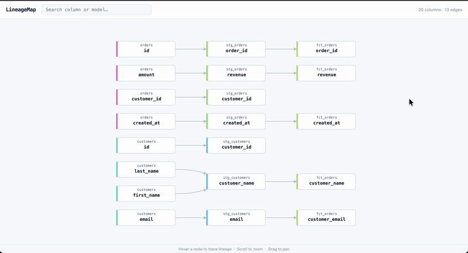

**LineageMap**



This document is a work in progress as I am still working on packaging the tool; visit the repository to track progress!

LineageMap is a lightweight, open source tool that gives data engineers column-level lineage for dbt projects; no catalog required.

Most teams either have no lineage visibility at all, or they're paying five figures a year for an enterprise catalog. LineageMap sits in the middle: run one command against your dbt project and get an interactive graph showing exactly where every column comes from and what breaks if you change it.

Great for demos, and for giving business users confidence in the data that they use daily!

**Why am I building LineageMap?**
Perhaps this is an uncommon problem, but across every team I've been on, there was no lineage tracing; people suggest solutions, cost is surfaced, and it gets swept under the rug.

In more recent years, it has become easier to point an LLM at the repository to answer lineage questions, but why waste tokens when a CLI tool can answer the question more quickly?

**Why LineageMap?**

With this library I'm looking to solve the "where does this metric come from?" question that takes hours to answer manually. It also surfaces impact; hover any column and every downstream model, report, or transformation that depends on it lights up. That makes schema changes and refactors significantly less dangerous.

**Good for**

- Data engineers and analytics engineers working with dbt who want lineage without the overhead of a full data catalog
- Small to mid-sized teams that have outgrown "just read the SQL" but can't justify Atlan or Collibra
- Anyone who's ever broken a downstream dashboard by renaming a column

**How it works**

Reads dbt's compiled `manifest.json`; no live warehouse connection needed; parses the SQL with [sqlglot](https://github.com/tobymao/sqlglot) to extract column-level dependencies, and builds a traversable graph you can explore in the terminal or a web UI. No live warehouse connection, no catalog setup.

```
$ lineagemap trace --column revenue

revenue (fct_orders)
└── revenue (stg_orders)
    └── amount (raw.orders)
```

The web UI (`lineagemap serve`) lets you hover any node to see its full upstream and downstream lineage highlighted instantly. A search bar filters by column or model name. The server can be self-hosted with Docker so your whole team has access without needing Python or a local `dbt compile`.

**Landscape note**

dbt Core v2.0 (Fusion) now ships column-level lineage in OSS, and [dbt-column-lineage](https://github.com/nickvdyck/dbt-column-lineage) covers similar ground with the same sqlglot approach. The CLI problem is largely solved. What remains is a polished web UI and a hosted/shareable tier that allows one to upload a manifest, send a stakeholder a link, no local setup required. That is what I hope to build LineageMap toward.

|                         | LineageMap    | dbt Fusion   | dbt-column-lineage | dbt Cloud | DataHub     |
|-------------------------|:-------------:|:------------:|:------------------:|:---------:|:-----------:|
| Column-level lineage    | ✅             | ✅            | ✅                  | ✅         | ✅           |
| One-command setup       | ✅             | ✅ (built-in) | ✅                  | N/A       | ❌           |
| Interactive web UI      | ✅             | ❌            | ❌                  | ✅         | ✅           |
| Shareable URL           | Coming (v0.3) | ❌            | ❌                  | ✅         | ❌           |
| No warehouse connection | ✅             | ✅            | ✅                  | ✅         | ❌           |
| Self-hostable           | ✅             | ✅            | ✅                  | ❌         | ✅ (complex) |
| Cost                    | Free          | Free         | Free               | $$$       | Free (DIY)  |

**Roadmap**

- [x] Phase 1: CLI + SQL parser (`lineagemap trace`)
- [x] Phase 2: Local web UI with interactive DAG visualization
- [ ] Phase 3: Hosted tier; upload `manifest.json`, get a shareable URL
- [ ] Phase 4: GitHub Action; post updated lineage URL on every dbt PR
