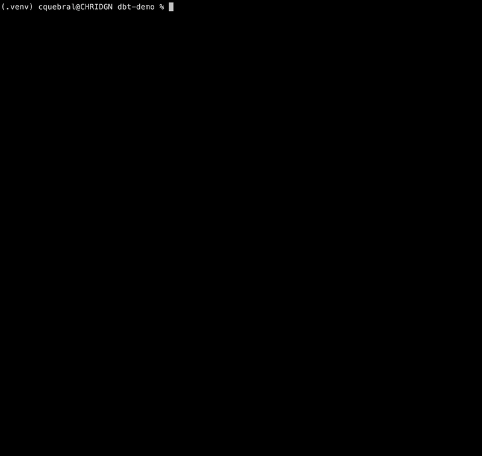

This project is now live and available on PyPi! Visit the link above or install with:

```
pip install logictrace
```

---

## Why Logictrace?

There is a moment every data engineer knows. You open a final mart: `fct_revenue_monthly`, and a stakeholder asks: "What exactly is `revenue`? Where does it come from? Is it net or gross? Does it include refunds?"

You open the model. It's a `SUM`... of what? You trace it back to intermediate. That column came from staging. Staging cast it from something in raw. Along the way there was a filter - Transactions above $1,000 only - that nobody documented. You've now spent twenty minutes reading SQL across four models to reconstruct something that should have been a one-liner. logictrace is that one-liner.

---

## What it does


Point logictrace at any column in any model and it walks the dependency chain back to the source, classifying every transformation it finds along the way:

```
Tracing: fct_revenue_monthly.revenue
────────────────────────────────────────────────────────────────────────────────

Step 1 · raw_transactions [source]
  Field origin: sale_price
  No transformations at this layer.

Step 2 · stg_transactions [staging]
  → Cast: sale_price → transaction_amount
  → Renamed: sale_price → transaction_amount
  ┌─ models/staging/stg_transactions.sql:3
  │  CAST(sale_price AS DOUBLE) AS transaction_amount

Step 3 · int_transactions_cleaned [intermediate]
  → Filtered: WHERE transaction_amount > 1000
  ┌─ models/intermediate/int_transactions_cleaned.sql:3
  │  transaction_amount

Step 4 · fct_revenue_monthly [marts]
  → Aggregated: transaction_amount → revenue
  → Renamed: transaction_amount → revenue
  ┌─ models/marts/fct_revenue_monthly.sql:3
  │  SUM(transaction_amount) AS revenue

────────────────────────────────────────────────────────────────────────────────

Summary
revenue is the monthly sum of sale_price (cast to DOUBLE) for transactions
above $1000. The filter is applied in int_transactions_cleaned before the
SUM aggregation occurs in the final mart.
```

The plain-English summary at the bottom is generated by Claude, but not by throwing the whole repo at it and hoping for the best. logictrace extracts only the SQL snippets relevant to the column being traced and sends those. The result comes back streamed so you're reading the answer before the full response is even assembled.

---

## How it works

logictrace reads `manifest.json` to build a column-level lineage graph without touching the warehouse. It then walks the graph hop by hop, from the final model back to the source, following the specific column at each step.

At each hop it classifies what happened: was the column cast to a different type? Renamed? Filtered? Aggregated into something new? These classifications (CAST, RENAME, FILTER, AGGREGATE, EXPRESSION) are deterministic: no AI involved, just SQL parsing with sqlglot. Claude only comes in at the end to stitch those labeled steps into a coherent explanation a non-engineer could read.

---

## Why I built it

LineageMap shows you the graph. logictrace explains the graph. They solve adjacent problems: one for exploration, one for the "I need to understand this specific column right now" moment.

The LLM-at-the-repo approach has become the default answer for lineage questions, but it's expensive and imprecise. You pay tokens to re-read models that have nothing to do with the column you care about, and you get explanations that hedge because the model isn't certain which of the ten places `revenue` appears is the right one. logictrace narrows the context before the model ever sees it, so the answer is faster, cheaper, and more accurate.

At least I hope.
