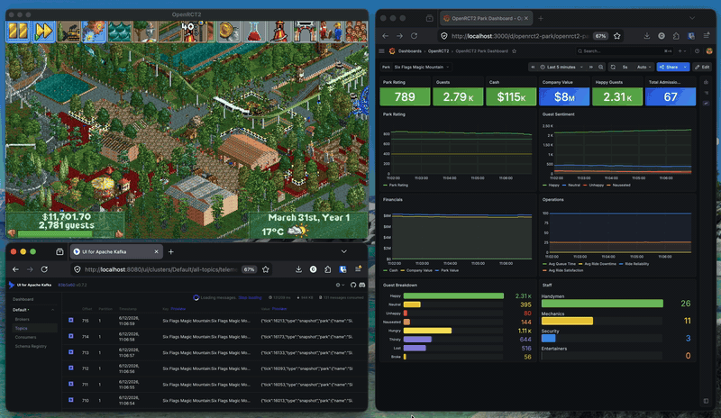
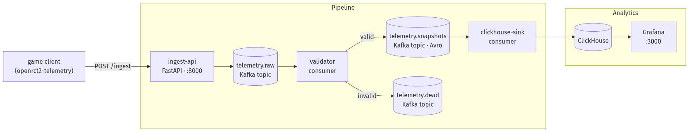
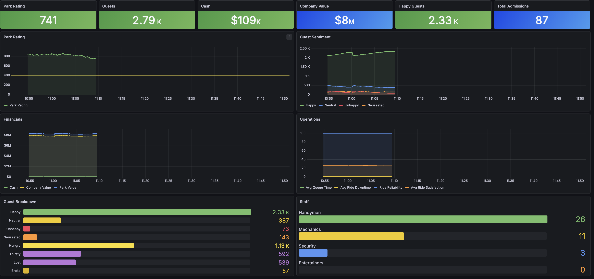

# OpenRCT2 Telemetry Pipeline

OpenRCT2 is one of my favorite management simulators. And Kafka is my favorite distributed log.

But Kafka isn't always the suitable tool for DataEng ingestion tasks, and I shouldn't be playing OpenRCT2 as much as I do when I should be building projects.

The solution? Create a plugin for OpenRCT2 that publishes data while I'm playing, and set up a Kafka ecosystem to ingest and process this data in real time.

---

## What is OpenRCT2?
OpenRCT2 is an open source project that breathes new life into Chris Sawyer's Roller Coaster Tycoon 1 and 2. It adds graphical support, improves QOL, and most importantly, enables a rich plugin ecosystem that anybody can contribute to.

---

## What is openrct2-telemetry?
In early 2026 I created a plugin that utilizes OpenRCT2's hooks that allow access to in-game data - park metrics such as guest count, average guest happiness, financial data, etc are made available at the hook level. 

The plugin can be configured to poll at a certain interval. Some devs might want to set it to 6540ms for a daily (ingame) snapshot of their park's performance. Others, like myself, might want to set the poll interval to 100ms to collect granular changes and stress test their Kafka eocosystems.

By installing this plugin and launching it alongside OpenRCT2, park data is published to a local HTTP endpoint accepting POST requests. This endpoint can then do anything with this data: write to a database, log to a console, or like the example below, produce events to a Kafka broker.

---

## The Pipeline


The pipeline consists of the following layers, all deployed at once via docker compose.

### 1. Ingest API Service
For security purposes, OpenRCT2 plugins cannot access resources over the internet. For this reason, I created a service on my machine that accepts POST requests with a JSON body and simply routes this data to a Kafka broker, no cleansing/validation involved.

```python
@app.post("/ingest", status_code=202)
async def ingest(request: Request):
    raw = await request.body()
    producer.produce(topic=RAW_TOPIC, value=raw)
    producer.flush()
    return {"status": "ok"}
```


### 2. Kafka Broker
A Kafka broker is provisioned using the `apache/kafka:latest` image. Topics are configured on startup with `init-topics.sh`. In addition, I am using `provectuslabs/kafka-ui:latest` for a Kafka UI (my personal favorite), and Confluent's `confluentinc/cp-schema-registry:8.0.0` for the schema registry

Topics created are:
- `telemetry.raw` - receives the JSON output directly from ingest-api. This is a raw landing topic with no strict schema, serving simply as a space to hold all output for replayability purposes.
- `telemetry.dead` - bit dramatic of a name, perhaps I should have chosen DLQ, but this is the dead letter queue where messages that cannot be processed by a downstream validator (see below) due to validation errors. This topic is configured to have a shorter retention time incase I need to do a quick audit before flushing/consuming the "failed" events.
- `telemetry` - this is the final topic that validated records are then sent to - configured with longer retention policy, zstd compression, and strict schema. This is the topic that is ready to be consumed from.

### 3. Consumers/Connectors
At this time, there are two consumers that process data from the kafka topics above.
- Validator (Python): this consumer takes data from `telemetry.raw` and uses Pydantic defined models to validate the data. Successful records are sent to `telemetry` with failed records sent to `telemetry.dead` (RIP)
- Clickhouse Sink (Python): While there is a ClickHouse Kafka Connect Sink out there, I sort of started writing a script and kept going with it. This consumer sinks data from `telemetry` to a Clickhouse database, where records are sorted by park name and tick.

### 4. Clickhouse
This project was actually my introduction to Clickhouse. I've chosen this datastore due to its columnar format making it an efficient tool to create separated dashboards using Grafana. At this layer, the data is completely flattened from its previous JSON shape into each key having its own field.

### 5. Grafana



This is where my eyes typically get glued to - I have set up a Grafana service that hosts a dashboard where I can view park metrics at a glance. If I was ever an analyst for Six Flags, this is where I'd spend all my time :)


---

## The Use Case
This portion is still in development, but I plan to have an alerting system to notify me of sharp decreases in guests/money - after all, when I'm in the zone, I'm not paying attention to the ingame telemetry system.

When that time comes, I'll update this doc - for now, I'll enjoy watching my Kafka topics fill up.

Now if you'll excuse me, I have a park to attend to.